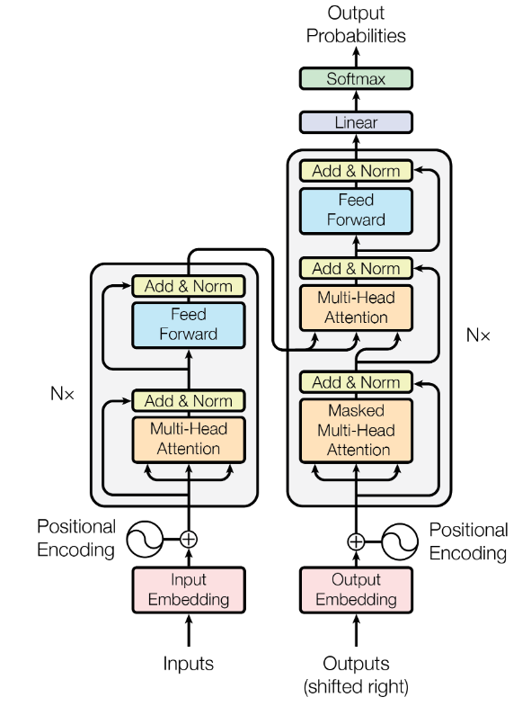
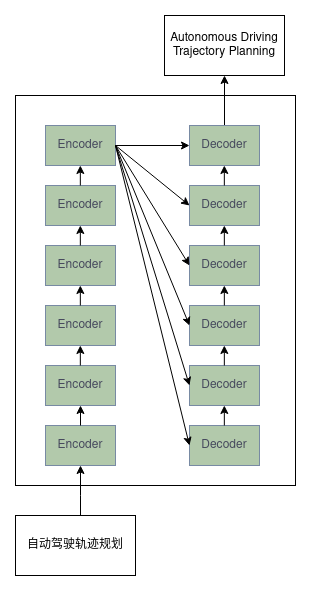

# Transformer 基础及细节学习

## 1、背景及框架

&emsp;&emsp;Transformer源自于谷歌的一篇论文《Attention Is All You Need》，因此后来的文本大模型领域的各家产品，都基于Transformer打造，包括现在的端到端自动驾驶和具身智能，可以说transformer是如今AI时代的鼻祖。  
&emsp;&emsp;神经网络深度学习概念已然存在很久，而Transformer的横空出世又一次的推动了全球AI的浪潮。与之前的网络架构RNN、GNN等的不同，Transformer最大的特点就是它可以**处理seq-to-seq的任务**，简单点讲就是它可以知道输入单元中各个token之间的依赖关系，比如输入的是一条中文句子要翻译成英文，则经过网络训练它可以知道输入的这个中文句子各个字或词之间的依赖关系;又比如自动驾驶轨迹规划领域，输入为自车的状态与障碍物的预测轨迹，则经过网络训练后它会理解输出自车未来的轨迹的每一个点的坐标都应该与障碍物保持距离，那这种机制就叫做注意力机制。  
&emsp;&emsp;我们可以先看一下这个网络的整体架构，接下来几章中我会逐步介绍Transfomer中的各个细节。下图是经典论文《Attention Is All You Need》中的模型架构图，主要**由左边N个编码器Encoder和右边N个解码器Decoder组成**，Encoder的输入即为原始输入，比如翻译任务中的原句子（以翻译任务：“自动驾驶轨迹规划”为例），Decoder的输入为不断将原句子的翻译结果标签右移，预测下一个词（比如输入[Autonomous Driving]后它会预测出下一个词[trajectory]）。

  

&nbsp;

&emsp;&emsp;下面我会以简单的机器翻译任务为例详细介绍Transformer的机制和架构，其整体架构如下,输入为“自动驾驶轨迹规划”，经过N层的Encoder编码后，其结果分别输入到N层的Decoder中，最后得到最终的翻译结果，接下来的章节我们来详细学习一下这个任务是怎么被完成的。

  

## 2、Encoder编码器

## 3、Decoder解码器

## 4、代码Demo实例
